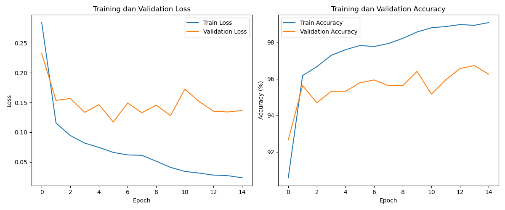
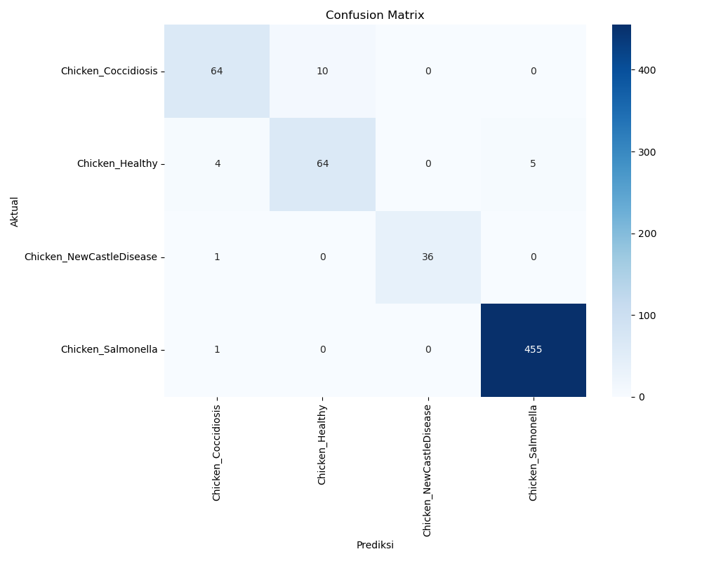

# Chicken Disease Classification using Vision Transformer (ViT-B/16)


## Overview

This project implements a deep learning-based classification system for chicken diseases using fecal sample images. By analyzing images of chicken feces, our model can detect various diseases with high accuracy, enabling early intervention and improved poultry health management.

The system uses the powerful **Vision Transformer (ViT-B/16)** architecture and achieves 96.72% accuracy on the test dataset.

## Table of Contents

- [Dataset](#dataset)
- [Model Architecture](#model-architecture)
- [Performance Metrics](#performance-metrics)
- [Installation](#installation)
- [Usage](#usage)
- [Web Interface](#web-interface)
- [Project Structure](#project-structure)
- [Training Results](#training-results)
- [References](#references)
- [License](#license)

## Dataset

The dataset consists of 8,067 images of chicken feces divided into four categories:

| Class | Training Samples | Testing Samples | Total |
|-------|------------------|----------------|-------|
| Chicken_Coccidiosis | 2,402 (32.3%) | 74 (11.6%) | 2,476 |
| Chicken_Healthy | 2,331 (31.4%) | 73 (11.4%) | 2,404 |
| Chicken_NewCastleDisease | 525 (7.1%) | 37 (5.8%) | 562 |
| Chicken_Salmonella | 2,169 (29.2%) | 456 (71.2%) | 2,625 |
| **Total** | **7,427** | **640** | **8,067** |

Dataset structure:
```
chicken_feces_dataset/
├── train/
│   ├── Chicken_Coccidiosis/
│   ├── Chicken_Healthy/
│   ├── Chicken_NewCastleDisease/
│   └── Chicken_Salmonella/
└── test/
    ├── Chicken_Coccidiosis/
    ├── Chicken_Healthy/
    ├── Chicken_NewCastleDisease/
    └── Chicken_Salmonella/
```

## Model Architecture

- **Architecture**: Vision Transformer (ViT-B/16)
- **Patch Size**: 16×16 pixels
- **Training Strategy**: Transfer learning with fine-tuning
- **Pre-trained Model**: Google's ViT-B/16 pre-trained on ImageNet
- **Image Size**: 224×224 pixels
- **Batch Size**: 16
- **Learning Rate**: 2e-5
- **Optimizer**: AdamW with learning rate scheduler

## Performance Metrics

The model achieved the following performance on the test dataset:

**Overall Metrics**:
- **Accuracy**: 96.72%
- **Precision**: 0.9669
- **Recall**: 0.9672
- **F1-Score**: 0.9670

**Per-Class Performance**:

| Class | Precision | Recall | F1-Score | Support |
|-------|-----------|--------|----------|---------|
| Chicken_Coccidiosis | 0.9143 | 0.8649 | 0.8889 | 74 |
| Chicken_Healthy | 0.8649 | 0.8767 | 0.8707 | 73 |
| Chicken_NewCastleDisease | 1.0000 | 0.9730 | 0.9863 | 37 |
| Chicken_Salmonella | 0.9891 | 0.9978 | 0.9934 | 456 |

## Installation

```bash
# Clone the repository
git clone https://github.com/yourusername/chicken-disease-classification.git
cd chicken-disease-classification

# Create and activate virtual environment
python -m venv venv
source venv/bin/activate  # Linux/Mac
# or
venv\Scripts\activate  # Windows

# Install dependencies
pip install -r requirements.txt
```

## Usage

### Analyzing the Dataset

```bash
python preprocessing.py
```

### Training the Model

```bash
python model.py
```

The training process will:
- Load and preprocess the dataset
- Train the Vision Transformer model
- Save the best model and final model
- Generate evaluation metrics and visualizations

### Evaluation Only

To evaluate a trained model:

```bash
python model.py --evaluate
```

## Web Interface

The project includes a web interface for real-time disease classification:

```bash
python app.py
```

Once running, access the web interface at http://localhost:5000.

The interface allows you to:
- Upload images of chicken feces
- Receive instant classification results
- View probability distribution across classes
- Access detailed information about detected diseases

## Project Structure

```
chicken_disease_classification/
│
├── model.py                 # Main model implementation and training code
├── preprocessing.py         # Data preprocessing utilities
├── app.py                   # Web application
├── model_utils.py           # Utilities for model operations
├── config.py                # Configuration parameters
├── requirements.txt         # Dependencies
│
├── templates/               
│   └── index.html           # Web interface template
│
├── model_output/            
│   ├── best_model.pth       # Best model weights
│   ├── final_model.pth      # Final model after training
│   ├── confusion_matrix.png # Confusion matrix visualization
│   └── training_curves.png  # Training and validation curves
│
└── README.md                # Project documentation
```

## Training Results

The model was trained for 15 epochs, with the best performance achieved in epoch 14:

- Training started with 90.59% accuracy in epoch 1
- Steadily improved to 99.07% training accuracy by epoch 15
- Best validation accuracy of 96.72% was achieved in epoch 14
- Training was conducted on CPU, taking approximately 18 hours




## Deployment

For production deployment:

```bash
pip install gunicorn
gunicorn app:app -b 0.0.0.0:5000
```

## Disease Information

### Coccidiosis
- **Description**: Parasitic disease caused by Eimeria genus protozoa affecting chicken intestines
- **Symptoms**: Bloody diarrhea, weight loss, decreased egg production, listlessness, increased mortality
- **Treatment**: Anticoccidial drugs like amprolium, sulfonamides, or ionophores; maintaining clean housing

### Newcastle Disease
- **Description**: Contagious viral disease affecting respiratory, nervous, and digestive systems
- **Symptoms**: Respiratory distress, neurological symptoms (tremors, twisted neck), greenish diarrhea, decreased egg production
- **Treatment**: No specific treatment; regular vaccination for prevention and isolation of infected birds

### Salmonella
- **Description**: Bacterial infection from Salmonella genus causing disease in both chickens and humans
- **Symptoms**: Diarrhea, lethargy, decreased appetite, increased thirst, increased mortality in chicks
- **Treatment**: Antibiotics like enrofloxacin or neomycin; improved sanitation and biosecurity

## References

- Vision Transformer paper: [An Image is Worth 16x16 Words: Transformers for Image Recognition at Scale](https://arxiv.org/abs/2010.11929)
- Google's ViT-B/16 pre-trained model: [google/vit-base-patch16-224](https://huggingface.co/google/vit-base-patch16-224)
- [Transformers library by HuggingFace](https://huggingface.co/docs/transformers/index)
- [PyTorch documentation](https://pytorch.org/docs/stable/index.html)

## License

This project is licensed under the MIT License - see the LICENSE file for details.

## Acknowledgments

- Google for the pre-trained ViT model
- HuggingFace for the Transformers library
- The PyTorch team for their excellent framework